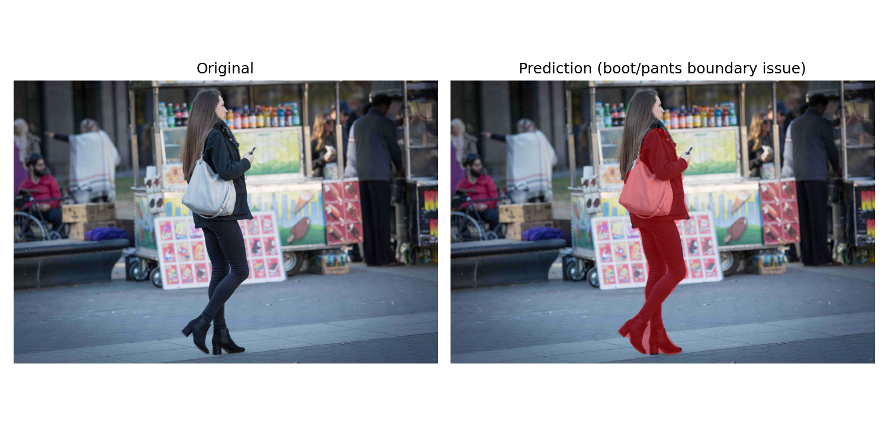
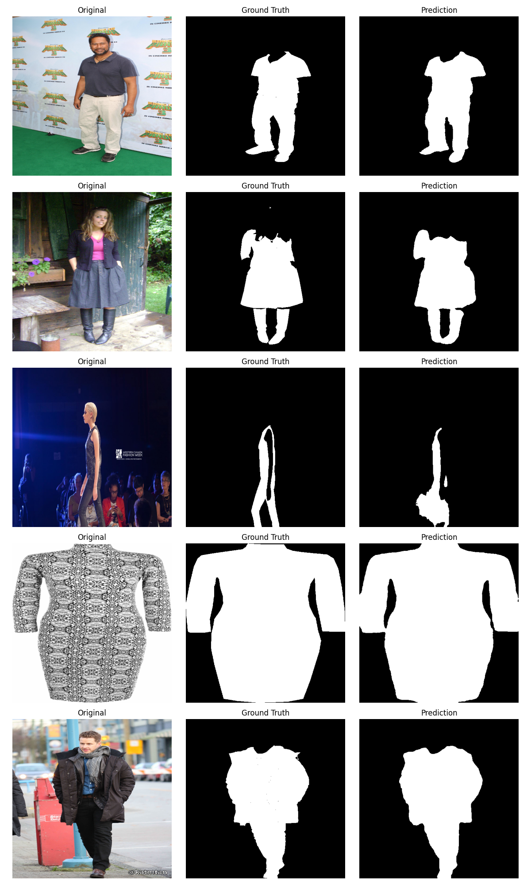
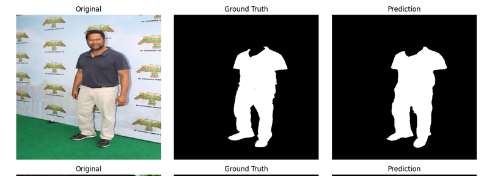
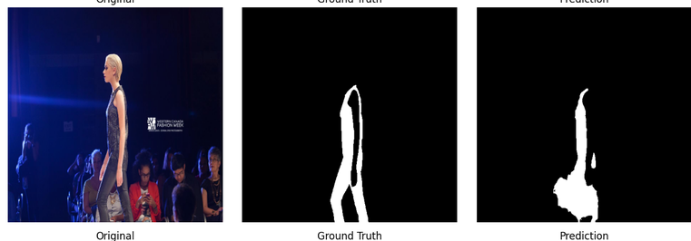

# 👗 Clothing Segmentation — Virtual Fitting Room AI

> Pixel-perfect clothing segmentation from real-world photos, powered by SegFormer-B0.


---

## ✨ See It In Action

<p align="center">
  
</p>

This model takes any photo of a person and produces a precise clothing mask — separating what someone is wearing from everything else in the frame. Built for use cases like **virtual fitting rooms**, **fashion cataloging**, and **outfit-swap applications**.

---

## 🎯 Why This Project

Clothing segmentation sits at the core of virtual try-on technology — but most tutorials stop at a Jupyter notebook with 60% accuracy. This project pushes further:

- 🏆 **92.6% Dice Score** / **87.8% Mean IoU** on held-out validation data
- 🧱 **Production-grade architecture** — no monolithic notebooks, fully modular codebase
- 🔍 **Honest, evidence-based limitations analysis** — see [report.md](report.md)
- ⚡ **Trained entirely on free-tier GPU** (Kaggle T4) — no expensive compute required

---

## 📊 Results at a Glance
| Metric | Score |
|---|---|
| Dice Score | **0.926** |
| Mean IoU | **0.878** |
| Pixel Accuracy | **0.976** |
<p align="center">
  
</p>

---

## 🗂️ Project Structure

```
clothing_segmentation/
├── config.py
├── train.py
├── evaluate.py
├── inference.py
├── requirements.txt
│
├── data_pipeline/
├── models/
├── losses/
├── metrics/
├── engine/
├── utils/
└── checkpoints/
```

> 💡 **Naming note:** the dataset module is called `data_pipeline/`, not `datasets/` — this avoids a real collision with the installed HuggingFace `datasets` library. Full story in [Challenges](#-challenges--lessons-learned).

---

## 🚀 Quick Start

### 1. Clone & install
```bash
git clone https://github.com/AhmedAbdAlkreem/clothing-segmentation
cd clothing_segmentation
pip install -r requirements.txt
```

### 2. Get the dataset
Download [iMaterialist Fashion 2020 (FGVC7)](https://www.kaggle.com/competitions/imaterialist-fashion-2020-fgvc7) from Kaggle, then point `config.py` at it:
```python
data_root: Path = Path("/path/to/imaterialist-fashion-2020-fgvc7")
```

### 3. Train
```bash
python train.py
```

### 4. Evaluate
```bash
python evaluate.py
```

### 5. Try it on your own photo
```bash
python inference.py --image_path your_photo.jpg --output_path result.png
```

<p align="center">
  
</p>

---

## 🔬 Reproducing These Results

| Setting | Value |
|---|---|
| Image size | 512×512 |
| Subset size | 3,000 images |
| Epochs | 20 |
| Batch size | 8 |
| Seed | 42 |

---

## 🧠 Design Highlights

- **Binary segmentation, not 46-class** — scoped precisely to "clothing vs. background."
- **Smart garment-part filtering** — sleeves, collars, zippers excluded from double-contributing to the mask.
- **SegFormer-B0 transformer backbone** — long-range context, lightweight enough for free-tier GPUs.
- **Dice + BCE combined loss** — handles background-pixel-dominant masks.
- **Mixed precision + gradient clipping** — fast, stable training on Kaggle's T4.

---

## 🔧 Challenges & Lessons Learned

| Challenge | Root Cause | Resolution |
|---|---|---|
| Dataset path mismatch | Kaggle mounted the dataset under a nested `competitions/` subfolder | Verified with `os.path.exists()`, fixed `config.py` |
| `ModuleNotFoundError` for existing files | Local `datasets/` folder collided with installed HuggingFace `datasets` package | Renamed to `data_pipeline/` |
| Fixes not taking effect | Jupyter caches imported modules in `sys.modules` | Forced full kernel restarts after source edits |
| Confusing import errors | Manual code transcription silently corrupted files | Added `ast.parse()` as mandatory pre-import syntax check |
| Empty scaffolded files | Placeholder files created via `Path.touch()` were never populated | Added file-content audit before every run |
| High average metrics hid real failures | Aggregate Dice/IoU didn't reveal specific failure modes | Ran deliberate visual stress-tests across varied images |

---

## ⚠️ Limitations

Full breakdown with annotated examples in [`report.md`](report.md).

<p align="center">
  
</p>

- 🌑 Performance degrades in low-light or backlit scenes
- 👗 Under-segments unusual garment shapes (flared/trailing hemlines)
- 👢 Minor boundary blur at low-contrast garment transitions
- ✂️ Edges are clean but not pixel-perfect — SegFormer-B0's lightweight decoder tradeoff

---


