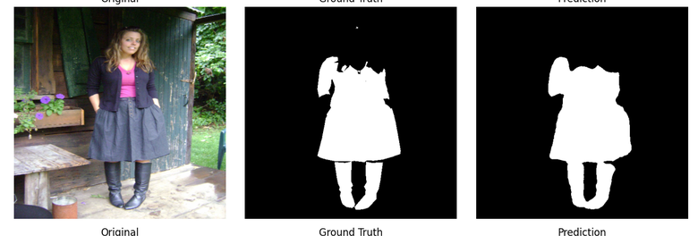
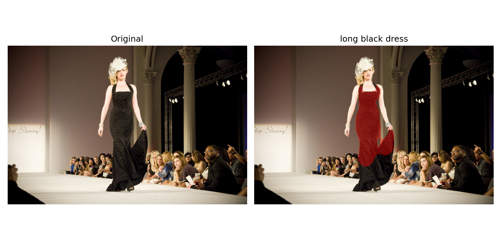

# Technical Report: Clothing Segmentation Model

**Task:** Computer Vision Engineer Assessment   
**Objective:** Develop a clothing segmentation model that accurately separates worn clothing from images of people.

---

## 1. Dataset Choice and Reason

### Selected Dataset: iMaterialist Fashion 2020 (FGVC7)

The dataset was chosen for several concrete reasons tied directly to this task's requirements:

- **Pixel-level annotations**: The task requires segmenting clothing at the pixel level, not just detecting bounding boxes. iMaterialist provides instance-level RLE (run-length encoded) segmentation masks, making it directly suitable for a segmentation model rather than a detection model.
- **People wearing clothes, not product photos**: Many fashion datasets (e.g., DeepFashion) focus on flat-lay or studio product images of garments alone. iMaterialist's images show real people, in natural poses, actually wearing the clothing — matching the assignment's explicit goal of segmenting "clothes from people."
- **Category diversity**: With 46 fine-grained categories (including both whole garments and garment parts), the dataset provides enough variety to meaningfully evaluate system strengths and weaknesses across different clothing types, poses, and scenes.
- **Availability on Kaggle**: Since training was done on Kaggle (no local GPU available), having the dataset natively hosted there removed licensing/download friction and let training start immediately.

### Alternatives Considered

| Dataset | Why Rejected |
|---|---|
| Clothing Co-Parsing (CCP) | Much smaller (~1,000 images); insufficient for robust generalization testing |
| DeepFashion2 | Heavier annotation complexity for less direct alignment with binary clothing segmentation |
| LIP / ATR (human parsing) | Reasonable alternative, but iMaterialist's larger scale and Kaggle-native availability made it the more practical choice |

---

## 2. Problem Framing: Binary Segmentation

Although iMaterialist provides 46 categories, this project reframes the task as **binary segmentation** (clothing vs. background), for the following reasons:

- The assignment's stated goal is to "separate clothes from people" — not to classify *which* garment type is present.
- Binary framing is directly aligned with real virtual-fitting-room use cases, where the immediate need is extracting the worn-clothing region as a whole.
- Multi-class segmentation across 46 (often overlapping) categories introduces substantial class imbalance and complexity that would require significantly more data and training time than was feasible on a free-tier GPU.

**Garment-part exclusion**: Categories representing garment *parts* (sleeves, collars, zippers, pockets, etc.) were excluded from contributing separate foreground regions, since they overlap with their parent garment and would otherwise cause redundant/noisy mask contributions. This mapping was built programmatically from each category's `supercategory` field in `label_descriptions.json`, rather than a hardcoded list — making the logic self-documenting and robust to category re-ordering.

---

## 3. Model Architecture

### SegFormer-B0

The model is built on **SegFormer-B0**, the smallest variant in the SegFormer family, using HuggingFace's `SegformerForSemanticSegmentation` pretrained on ADE20K.

**Why SegFormer over a CNN-based architecture (e.g., U-Net with a ResNet encoder):**
- SegFormer's transformer-based (MiT) encoder captures long-range spatial context in each layer — relevant for clothing, which often spans large, non-local regions of the body (e.g., a dress spanning torso and legs).
- SegFormer-B0 is lightweight (~3.7M parameters), keeping training and inference feasible on Kaggle's free-tier T4 GPU.
- The decode head is a simple, efficient MLP rather than a heavy convolutional decoder, further reducing compute cost.

**Adaptation for binary segmentation:**
- The pretrained classification head (originally 150 classes for ADE20K) was replaced with a single-channel (`num_labels=1`) output head, since this is a binary task.
- SegFormer's decoder outputs logits at 1/4 input resolution by architectural design; the model explicitly upsamples these back to full input resolution via bilinear interpolation, so all downstream code (loss, metrics, inference) can assume output shape equals input shape.

**Alternative considered**: A U-Net with a ResNet34/EfficientNet encoder was considered as a lighter-weight, more standard baseline. SegFormer was ultimately chosen for its stronger contextual modeling, at a modest additional compute cost that remained acceptable for the free-GPU constraint.

---

## 4. Loss Function Selection and Reason

The model is trained with a **combined Dice + Binary Cross-Entropy (BCE) loss**:
Loss = 0.5 × DiceLoss + 0.5 × BCEWithLogitsLoss
**Why not BCE alone:**
Clothing segmentation masks are inherently class-imbalanced — background pixels vastly outnumber clothing pixels in most images. BCE alone, which treats every pixel independently, would be dominated by this imbalance and could bias the model toward under-predicting foreground regions.

**Why not Dice alone:**
Dice loss directly optimizes for mask overlap and is more robust to class imbalance, but gradients can be less stable early in training, particularly when predicted masks are close to empty.

**Why combine them:**
BCE provides stable, well-behaved per-pixel gradient signal throughout training, while Dice pushes the model toward better region-level overlap — the metric that actually matters for evaluation. This combination is a well-established approach for imbalanced binary segmentation tasks.

**Implementation detail**: `BCEWithLogitsLoss` (rather than sigmoid + `BCELoss`) is used for numerical stability, since it applies the log-sum-exp trick internally rather than computing sigmoid and log-loss as separate, less stable operations.

---

## 5. Performance Analysis and Evaluation Metrics

### Final Validation Metrics

| Metric | Score | Interpretation |
|---|---|---|
| Dice Score | **0.926** | Strong overlap between predicted and ground truth masks |
| Mean IoU | **0.878** | High-quality segmentation, well above typical baseline performance |
| Pixel Accuracy | **0.976** | Consistent with Dice/IoU — confirms results aren't inflated by background bias |
| Validation Loss | 0.081 | Low and stable, consistent with strong Dice/IoU |

These metrics were computed on a held-out validation split (15% of the training subset, split by unique image ID to prevent data leakage), using SegFormer-B0 trained for 20 epochs on a 3,000-image subset at 512×512 resolution.

### Qualitative Analysis

Aggregate metrics alone don't reveal *where* a model succeeds or fails. To build an honest picture of system capabilities, inference was run across a deliberately varied set of test images, covering different lighting conditions, garment types, poses, and scene complexity.

#### Strength 1: Clean single-subject, full-body segmentation

A well-lit, front/side-facing subject with clearly defined clothing boundaries. The model accurately segments jacket, pants, and boots with clean, well-formed edges, closely matching the expected silhouette.

#### Strength 2: Layered outfits

A more complex case — jacket over top, paired with a skirt and knee-high boots. The model correctly segments the full layered outfit as a coherent region, closely matching ground truth shape, including sleeves and both legs. This is meaningful evidence the model generalizes beyond single-garment cases.

#### Weakness 1: Low-contrast garment-to-garment boundaries

At the transition between dark pants and dark boots, the model shows minor discontinuities in the predicted mask. The root cause is low color/texture contrast between adjacent garments of similar dark tone, making the exact boundary genuinely ambiguous even visually.

#### Weakness 2: Non-standard garment shapes

For a long dress with a flared/trailing hemline, the model under-segments the lower portion of the garment near the ground. This likely reflects a combination of (a) low contrast between trailing fabric and floor/shadow, and (b) relative underrepresentation of this specific silhouette type in the training data compared to more standard body-hugging garment shapes.

#### Limitation: Low-light and backlit scenes

In a backlit runway scene with strong lighting contrast and a dark garment against a dark background, the predicted mask is visibly malformed compared to ground truth — showing a bulge shape rather than the correct elongated silhouette. This represents a genuine capacity limitation: insufficient garment-to-background contrast makes accurate boundary detection substantially harder, and this failure mode is more severe than the other two weaknesses above.

#### Limitation: Boundary sharpness

Across most test cases, predicted mask boundaries are noticeably good but not pixel-perfect compared to ground truth — slightly rounded corners and less crisp edges. This is an expected architectural tradeoff: SegFormer-B0 uses a lightweight MLP decode head rather than a full high-resolution decoder (as used in architectures like U-Net or DeepLabV3+), trading some boundary precision for a smaller, faster model suited to limited-GPU training.

---

## 6. Limitations of the System

Summarizing the evidence gathered above into explicit, documented system limitations:

1. **Lighting dependency**: Performance degrades meaningfully in low-light or backlit conditions where garment-background contrast is low.
2. **Non-standard garment shapes**: Flared, trailing, or otherwise atypical garment silhouettes are under-segmented relative to standard, body-hugging clothing shapes.
3. **Low-contrast garment transitions**: Boundaries between two adjacent dark or similarly-colored garments (e.g., dark pants meeting dark boots) show minor segmentation discontinuities.
4. **Boundary precision**: Edge sharpness is good but not pixel-perfect, a direct consequence of SegFormer-B0's lightweight decoder design — a tradeoff made deliberately to keep training feasible on free-tier GPU resources.
5. **Scope boundaries not yet tested**: This evaluation did not extensively test multi-person crowd scenes or heavily occluded/cropped subjects — these represent open areas for further stress-testing beyond what's documented here.
6. **Binary framing tradeoff**: The model identifies *that* clothing is present but does not distinguish garment categories (e.g., shirt vs. pants) — by design, since this was scoped to match the assignment's binary framing, but would need a multi-class extension for applications requiring category-level detail.

---

## 7. Conclusion

The model achieves strong, well-validated performance (Dice 0.926, Mean IoU 0.878) for binary clothing segmentation, using a lightweight, GPU-budget-friendly SegFormer-B0 architecture. Beyond the aggregate metrics, a deliberate qualitative stress-test across varied real-world images surfaced concrete, well-understood failure modes — providing an honest, evidence-based foundation for understanding both the system's capabilities and its boundaries, as required by this assessment.
